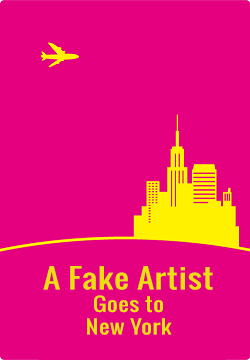

# Ein Fake Artist geht nach Zürich

Deutsche version vom Zeichnen und Rate spiel.
Die Wortliste entählt ein paar Schweizer Wörter.



Du Spielst gegen die app, das bedeutet die Wortliste in `words-de.js` sollte Kategorien enthalten welche nahe am Wort sind.

## Project Setup
```
npm install
npm run build
```
