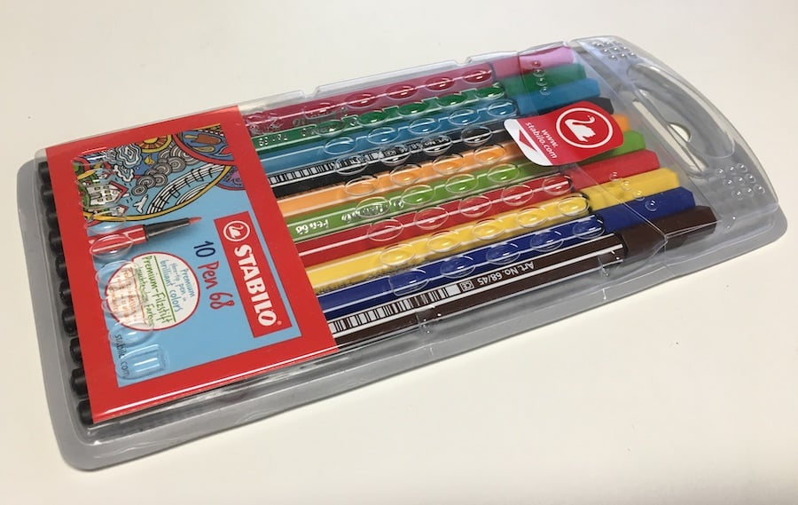

# Ein Fake Artist geht nach Zürich

Deutsche version vom Zeichnen und Rate spiel; A fake Artist goes to New York.
Die Wortliste enthält ein paar Schweizer Wörter.

  

## Wie man es spielt
Das phone (mit der App) gibt vor was man zeichnet und wer der "Fake Artist" ist. Das phone wird mit dem Papier weitergegeben und jeder Spieler kann selbst für seine Farbe nachschauen, ob er der Fake ist.

[Regeln](https://oinkgms.com/de/a-fake-artist-goes-to-new-york) [Rules PDF EN](https://tesera.ru/images/items/744225/rule_fakeartist_e.pdf)

## Wörter
Die App ist auf der Seite des Fake Artist, deshalb sollte die Wortliste `words-de.js` Kategorien+Wörter paare enthalten welche einfach zu erraten sind.
